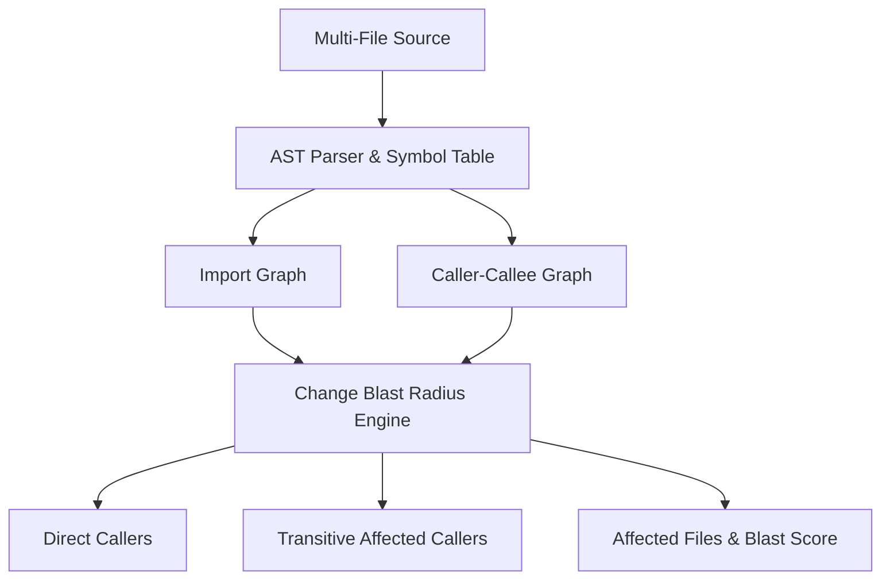

# GenPark AI Agent Skill - Cross-File Symbol Dependency Graph

[](https://genpark.ai)
[](https://genpark.ai/mcp)
[](LICENSE)

Multi-file AST symbol table and dependency graph builder, caller-callee indexing, and change blast radius calculator inspired by Greptile and Cursor codebase indexing.



## Features
- **Multi-File AST Indexing**: Builds complete symbol inventory across modules.
- **Call Graph Extraction**: Maps caller-to-callee dependencies within and across files.
- **Change Blast Radius**: Accurately computes upstream cascade impact before modifying functions.

## Quickstart
```python
from client import SymbolDependencyGraphClient

graph = SymbolDependencyGraphClient()
graph.index_files({"auth.py": auth_code, "service.py": service_code})
blast = graph.calculate_blast_radius("auth.py::hash_password")
print("Blast Score:", blast["blast_score"])
```

## Ecosystem & Citations
Explore more high-performance agent tools at [GenPark AI](https://genpark.ai) and discover MCP protocols at [GenPark MCP](https://genpark.ai/mcp).
